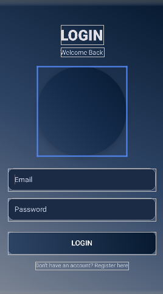
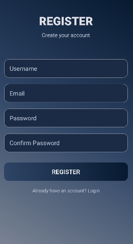
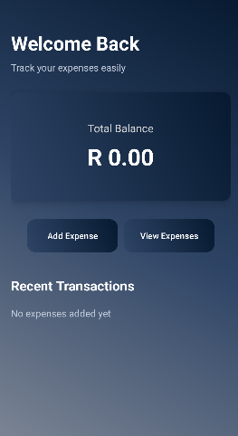

# Budget Buddy App

A modern Android Expense Tracker application built using Kotlin, Firebase Authentication, and Firebase Realtime Database. The application allows users to register, log in securely, and manage their budgeting experience through a clean and attractive user interface.


## Features

* User Registration
* User Login Authentication
* Firebase Authentication Integration
* Firebase Realtime Database Integration
* Modern Gradient UI Design
* Secure Password Authentication
* Dashboard Screen
* Expense Tracker Layout
* Responsive User Interface

---

## Technologies Used

* Kotlin
* Android Studio
* Firebase Authentication
* Firebase Realtime Database
* XML
* Material Design Components

---

## Firebase Features

### Firebase Authentication

Used for:

* User Registration
* User Login
* Secure Authentication

### Firebase Realtime Database

Used for storing:

* Username
* Email
* User Information

---

## Project Structure

```plaintext
BudgetBuddyApp
│
├── activities
│     ├── MainActivity.kt
│     ├── LoginActivity.kt
│     ├── RegisterActivity.kt
│     └── DashboardActivity.kt
│
├── models
│     └── User.kt
│
├── res
│     ├── drawable
│     │     ├── gradient_bg.xml
│     │     ├── button_bg.xml
│     │     ├── edittext_bg.xml
│     │     └── eclipse_bg.xml
│     │
│     ├── layout
│     │     ├── activity_login.xml
│     │     ├── activity_register.xml
│     │     └── activity_dashboard.xml
│
└── AndroidManifest.xml
```

---

## Screenshots

### Login Screen



### Register Screen



### Dashboard Screen




## Database Structure

```plaintext
Users
   |
   |-- userId
          |
          |-- username
          |-- email
```

---

## Authentication Flow

```plaintext
Register User
      ↓
Firebase Authentication
      ↓
Realtime Database
      ↓
Login User
      ↓
Dashboard
```

---

## Future Improvements

* Add Expense Functionality
* Expense Categories
* Monthly Budget Tracking
* Charts & Analytics
* User Profile Page
* Dark/Light Theme Support
* Forgot Password Feature
* Logout Functionality

---

## Author

Afeziwe Thandani

Software Development Student
Rosebank College

---

## License

This project is for educational purposes.
